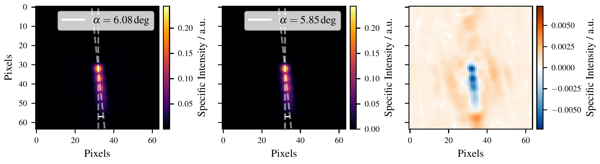
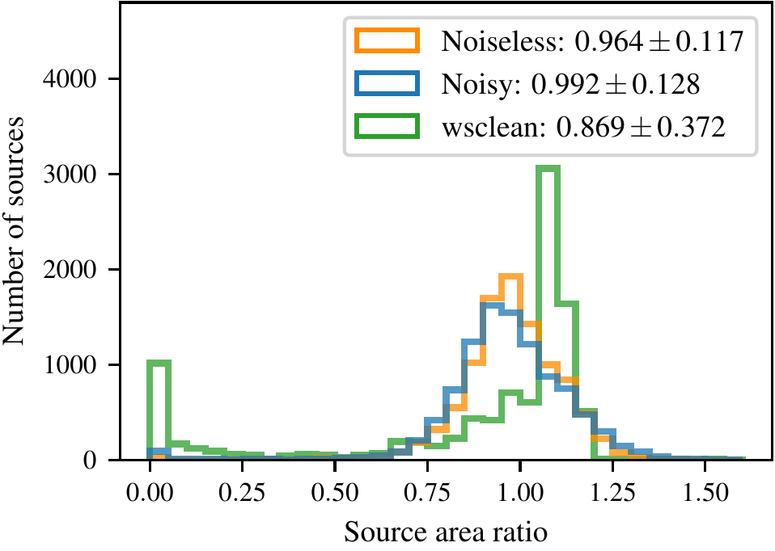

# radionets [](https://github.com/radionets-project/radionets/actions) [](https://codecov.io/gh/radionets-project/radionets)


## Imaging Radio Interferometric Data with Neural Networks

Deep-learning framework for the simulation and analysis of radio interferometric data in Python. The goal is to reconstruct calibrated observations with
convolutional Neural Networks to create high-resolution images. For further information, please have a look at our [paper](https://www.aanda.org/component/article?access=doi&doi=10.1051/0004-6361/202142113).

Analysis strategies leading to reproducible processing and evaluation of data recorded by radio interferometers:
* Simulation of datasets (see also the `radiosim` [repository](https://github.com/radionets-project/radiosim))
* Simulation of radio interferometer observations (see also the `pyvisgen` [repository](https://github.com/radionets-project/pyvisgen))
* Training of deep learning models
* Reconstruction of radio interferometric data

## Installation

This repository is built as a python package. We recommend creating a mamba environment to handle the dependencies of all packages.
You can create one by running the following command in this repository:
```
$ mamba env create -f environment.yml
```
Depending on your `cuda` version you have to specify the `cudatoolkit` version used by `pytorch`. If you are working on machines
with `cuda` versions < 10.2, please change the version number in the environment.yml file. Since the package `pre-commit` is used, you need to execute 
```
$ pre-commit install
```
after the installation.

## Usage

For each task, executables are installed to your `PATH`. Each takes `toml` configuration files as input to manage data paths and options.
Simulated data is saved in `hdf5`; trained models are saved as `pickle` files.

* `radionets_simulations <...>`
  This script is used to simulate radio interferometric data sets for the training of deep learning models.
* `radionets_training <...>`
  This script is used to train a model on events with known truth
  values for the target variable, usually Monte Carlo simulations.
* `radionets_evaluation <...>`
  This script is used to evaluate the performance of the trained deep-learning models.

Default configuration files can be found in the examples directory. The examples directory contains `jupyter notebooks`, which show an example
analysis pipeline and the corresponding commands. (need a rework)

## Structure of the Repository

### dl_framework

The used deep learning framework is based on [pytorch](https://pytorch.org/) and [fastai](https://www.fast.ai/).
An introduction to Neural Networks and an overview of the use of fastai to train deep learning models can be found in [Practical Deep Learning for Coders, v3](https://course.fast.ai/index.html) and [fastbook](https://github.com/fastai/fastbook).

### dl_training

Functions for handling the different training options. Currently, there are the training, the learning rate finder, and the loss plotting mode available.

### simulations (further developed in [pyvisgen](https://github.com/radionets-project/pyvisgen) repository)

Functions to simulate and illustrate radio interferometric observations. At the moment simulations based on the MNIST dataset and 
simulations of Gaussian sources are possible. We are currently working on simulating visibilities directly in Fourier space.
For more information, visit our corresponding repository [pyvisgen](https://github.com/radionets-project/pyvisgen). In the future, the simulations will be created
using the `pyvisgen` repository, while the `radionets` repository contains the training and evaluation methods.

### evaluation

Functions for the evaluation of the training sessions. The available options reach from single, exemplary plots in (u, v) space and image space to
methods computing characteristic values on large test datasets. In detail:

* Amplitude and phase for the prediction and the truth. Example image below includes the difference between prediction and truth.

* Reconstructed source images with additional features, such as MS-SSIM values or the viewing angle. Example image below.

* Histogram of differences between predicted and true viewing angles. The image includes a comparison with [wsclean](https://gitlab.com/aroffringa/wsclean).

* Histogram of the ratio between predicted and true source areas. The image includes a comparison with [wsclean](https://gitlab.com/aroffringa/wsclean).

* Histogram of flux difference in the core component. The image includes a comparison with [wsclean](https://gitlab.com/aroffringa/wsclean).

* Included, but not yet fully operational
  * Histogram of differences between predicted and true MS-SSIM values on a dedicated test dataset
  * Histogram of differences between predicted and true dynamic range values on a dedicated test dataset

All histograms are created on a dedicated test dataset.

## Contributors

* Kevin Schmidt [@Kevin2](https://github.com/Kevin2)
* Felix Geyer [@FeGeyer](https://github.com/FeGeyer)
* Arne Poggenpohl [@ArnePoggenpohl](https://github.com/ArnePoggenpohl)
* Stefan Fröse [@StFroese](https://github.com/StFroese)
* Paul-Simon Blomenkamp [@PBlomenkamp](https://github.com/PBlomenkamp)
* Olivia Locke [@olivialocke](https://github.com/olivialocke)
* Kevin Laudamus [@K-Lauda](https://github.com/K-Lauda)
* Emiliano Miranda [@emilianozm24](https://github.com/emilianozm24)
* Maximilian Büchel [@MaxBue](https://github.com/MaxBue)
* Rune Dominik [@RuneDominik](https://github.com/RuneDominik)

## Versions used and tested

* Python >= 3.8
* pyTorch >= 1.11.0
* torchvision >= 0.12.0
* cudatoolkit >= 11.3
